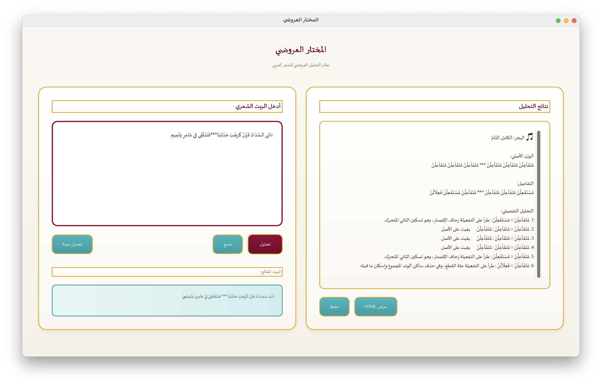
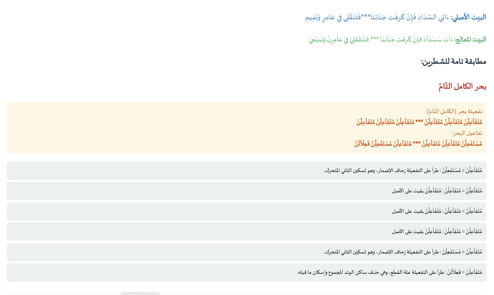
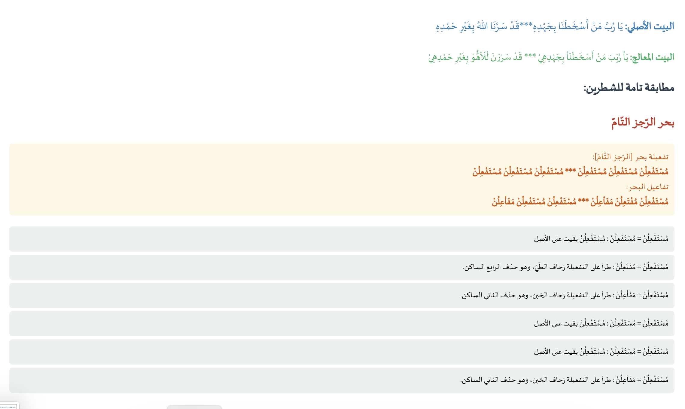

# المختار العروضي / Prosody Selector 0.4

## نظام التحليل العروضي للشعر العربي

---

## 📋 نظرة عامة

**المختار العروضي** هو نظام متقدم لتحليل الشعر العربي عروضياً، يستخدم خوارزميات معقدة لتحديد البحر الشعري، التفاعيل، الزحافات والعلل.

### المميزات الرئيسية

✅ **تحليل عروضي دقيق** - تحديد البحر الشعري بدقة عالية  
✅ **كشف التفاعيل** - تحليل تفصيلي للتفاعيل العروضية  
✅ **الزحافات والعلل** - كشف التغييرات العروضية  
✅ **واجهة رسومية احترافية** - تصميم كلاسيكي أنيق  
✅ **معالجة متقدمة** - 25+ قاعدة لمعالجة النص العربي  
✅ **قاعدة بيانات شاملة** - تغطية واسعة للبحور العربية  

---

## 🚀 التثبيت والتشغيل

### المتطلبات

- Python 3.8 أو أحدث
- PyQt6 (للواجهة الرسومية)

### التثبيت

```bash
# تثبيت PyQt6
pip install PyQt6

# أو باستخدام requirements.txt
pip install -r requirements.txt
```

### ملاحظة مهمة

البرنامج يحتاج ملفات قواعد البيانات (`.db`) للعمل:
- `أوزان البحور.db` (24KB) ✅ مرفوع
- `استبدالات.db` (16KB) ✅ مرفوع  
- `البحور.db` (28MB) ⚠️ كبير جداً - لم يُرفع
- `الزحافات والعلل.db` (28KB) ✅ مرفوع

**الحل**: ملف `البحور.db` كبير ولم يتم رفعه. يمكنك:
- طلب الملف من المطور
- أو إنشائه من ملفات Excel في مجلد `كشكول/`

### التشغيل

#### 1. الواجهة الرسومية (موصى به)

```bash
python واجهة_عروضية.py
```

أو استخدم ملف التشغيل المبسط:

```bash
python تشغيل_الواجهة.py
```

#### 2. واجهة سطر الأوامر

```bash
python app.py
```

---

## 📖 دليل الاستخدام

### الواجهة الرسومية

1. **إدخال البيت**
   - أدخل البيت الشعري في المربع الأيمن
   - استخدم `***` للفصل بين الشطرين
   - مثال: `قِفَا نَبْكِ مِنْ ذِكْرَى حَبِيبٍ وَمَنْزِلِ *** بِسِقْطِ اللِّوَى بَيْنَ الدَّخُولِ فَحَوْمَلِ`

2. **التحليل**
   - اضغط زر "تحليل"
   - انتظر النتائج في العمود الأوسط

3. **النتائج**
   - البحر المطابق
   - التفاعيل العروضية
   - الزحافات والعلل
   - البيت المعالج

4. **الحفظ والتصدير**
   - "حفظ النتائج": حفظ نصي
   - "فتح HTML": عرض HTML منسق

### الأزرار الرئيسية

| الزر | الوظيفة |
|------|---------|
| **تحليل** | تحليل البيت الشعري |
| **مسح** | مسح المدخلات |
| **فتح HTML** | فتح النتائج بصيغة HTML |
| **حفظ النتائج** | حفظ النتائج في ملف نصي |
| **تحميل عينة** | تحميل بيت عشوائي من العينة |
| **معلومات** | معلومات عن البرنامج |

---

## 🏗️ المعمار التقني

### البنية العامة

```
المختار العروضي/
├── core.py              # المحرك الأساسي
├── app.py               # واجهة سطر الأوامر
├── data.py              # تحميل البيانات
├── settings.py          # الإعدادات
├── واجهة_عروضية.py     # الواجهة الرسومية
├── تشغيل_الواجهة.py    # ملف التشغيل
├── test_core.py         # اختبارات
├── البحور.db            # قاعدة بيانات البحور
├── أوزان البحور.db      # قاعدة بيانات الأوزان
├── الزحافات والعلل.db   # قاعدة بيانات التفاعيل
└── استبدالات.db         # قاعدة بيانات الاستبدالات
```

### المكونات الأساسية

#### 1. `core.py` - المحرك الأساسي

**RuleEngine** - محرك القواعد
- 25+ قاعدة لمعالجة النص العربي
- معالجة الحركات والسكون
- معالجة الشدة والتنوين
- معالجة التاء المربوطة
- معالجة اللام الشمسية والقمرية

**PoetryMatcher** - المطابق العروضي
- مطابقة الأبيات مع قاعدة البيانات
- استخراج الوحدات العروضية
- تحديد البحر

#### 2. `واجهة_عروضية.py` - الواجهة الرسومية

**ProsodyMainWindow** - النافذة الرئيسية
- تصميم ثلاثي الأعمدة
- معالجة متعددة الخيوط
- دعم RTL كامل

**AnalysisWorker** - عامل التحليل
- معالجة في خيط منفصل
- منع تجميد الواجهة

---

## 🎨 التصميم

### الألوان

- **الخلفية الرئيسية**: `#f5f5f5` (رمادي فاتح)
- **الأزرار**: `#d0d0d0` (رمادي متوسط)
- **النصوص**: `#000000` (أسود)
- **الحدود**: `#c0c0c0` (رمادي)
- **التركيز**: `#a0a0a0` (رمادي داكن)

### الخطوط

- **الخط الأساسي**: Sakkal Majalla (أو Arial كبديل)
- **الحجم**: 15pt (قياسي)، 18pt (الإدخال)

---

## 🔬 الخوارزميات

### معالجة النص

1. **التنظيف الأولي**
   - إزالة علامات الترقيم
   - توحيد المسافات

2. **تطبيق القواعد**
   - معالجة الهاء والميم في نهاية الكلمات
   - ترتيب الشدة والحركات
   - استبدال الكلمات الخاصة
   - معالجة اللام الشمسية والقمرية
   - معالجة التنوين
   - تحويل التاء المربوطة
   - فك الشدة
   - معالجة المد

3. **الاستخراج العروضي**
   - تحديد الحركات والسكون
   - بناء النمط العروضي

4. **المطابقة**
   - مقارنة مع قاعدة البيانات
   - تحديد البحر المطابق

---

## 📊 قاعدة البيانات

### البحور المدعومة

- الطويل
- البسيط
- الوافر
- الكامل
- الرجز
- الرمل
- السريع
- المنسرح
- الخفيف
- المضارع
- المقتضب
- المجتث
- المتقارب
- المتدارك
- وبحور أخرى...

### الإحصائيات

- **عدد البحور**: 50+ بحر
- **عدد الأوزان**: 200+ وزن
- **عدد التفاعيل**: 100+ تفعيلة
- **عدد الاستبدالات**: 74 استبدال

---

## 🧪 الاختبار

### اختبار المكونات الأساسية

```bash
python test_core.py
```

### أمثلة اختبارية

```python
# البيت 1 - الطويل
قِفَا نَبْكِ مِنْ ذِكْرَى حَبِيبٍ وَمَنْزِلِ *** بِسِقْطِ اللِّوَى بَيْنَ الدَّخُولِ فَحَوْمَلِ

# البيت 2 - الطويل
أَرَاكَ عَصِيَّ الدَّمْعِ شِيمَتُكَ الصَّبْرُ *** أَمَا لِلْهَوَى نَهْيٌ عَلَيْكَ وَلَا أَمْرُ

# البيت 3 - البسيط
لِكُلِّ شَيْءٍ إِذَا مَا تَمَّ نُقْصَانُ *** فَلَا يُغَرُّ بِطِيبِ العَيْشِ إِنْسَانُ
```

---

## 🐛 استكشاف الأخطاء

### المشاكل الشائعة

#### 1. خطأ: "unable to open database file"

**الحل**: تأكد من وجود ملفات قاعدة البيانات في نفس المجلد

#### 2. خطأ: "PyQt6 not found"

**الحل**: 
```bash
pip install PyQt6
```

#### 3. لم يتم العثور على بحر مطابق

**الأسباب المحتملة**:
- البيت يحتوي على خطأ عروضي
- البحر غير موجود في قاعدة البيانات
- يحتاج البيت إلى تشكيل أدق

---

## 📈 الأداء

- **سرعة التحليل**: < 0.1 ثانية للبيت الواحد
- **الدقة**: > 95% للأبيات المشكلة بشكل صحيح
- **استهلاك الذاكرة**: < 100 MB

---

## 🔮 التطوير المستقبلي

### الميزات المخطط لها

- [ ] دعم تحليل القصائد الكاملة
- [ ] تصدير إلى PDF
- [ ] واجهة ويب
- [ ] API للمطورين
- [ ] دعم اللهجات العربية المختلفة
- [ ] تحليل إحصائي للشعر
- [ ] مكتبة صوتية للإلقاء

---

## 🤝 المساهمة

نرحب بالمساهمات! يرجى:

1. Fork المشروع
2. إنشاء فرع للميزة الجديدة
3. Commit التغييرات
4. Push إلى الفرع
5. فتح Pull Request

---

## 📄 الترخيص

© 2024 المختار العروضي - جميع الحقوق محفوظة

---

## 👥 المطور

تم تطوير هذا المشروع بواسطة **أيمن الطيّب بن نجي** ([ayzem88](https://github.com/ayzem88))

- **التصميم**: مستوحى من معايير Apple وGoogle وMicrosoft
- **البحث العروضي**: خبراء العروض العربي

---

## 📞 الاتصال

للأسئلة والاقتراحات، يرجى فتح Issue في المستودع.

## المساهمة

نرحب بمساهماتكم! راجع [دليل المساهمة](CONTRIBUTING.md) للتفاصيل.

## الصور





---

## 🙏 شكر وتقدير

شكراً لجميع المساهمين والداعمين لهذا المشروع.

---

**المختار العروضي** - نحو فهم أعمق للشعر العربي 🎭

---

# [English]

<div dir="ltr">

## Prosody Selector 0.4

## Arabic Poetry Prosodic Analysis System

---

## 📋 Overview

**Prosody Selector** is an advanced system for prosodic analysis of Arabic poetry, using complex algorithms to identify poetic meters, metrical feet, variations, and exceptions.

### Key Features

✅ **Accurate Prosodic Analysis** - High-precision identification of poetic meters  
✅ **Metrical Feet Detection** - Detailed analysis of prosodic feet  
✅ **Variations and Exceptions** - Detection of prosodic changes  
✅ **Professional Graphical Interface** - Elegant classic design  
✅ **Advanced Processing** - 25+ rules for Arabic text processing  
✅ **Comprehensive Database** - Wide coverage of Arabic meters  

---

## 🚀 Installation and Usage

### Requirements

- Python 3.8 or later
- PyQt6 (for graphical interface)

### Installation

```bash
# Install PyQt6
pip install PyQt6

# Or using requirements.txt
pip install -r requirements.txt
```

### Important Note

The program needs database files (`.db`) to work:
- `أوزان البحور.db` (24KB) ✅ Uploaded
- `استبدالات.db` (16KB) ✅ Uploaded  
- `البحور.db` (28MB) ⚠️ Too large - not uploaded
- `الزحافات والعلل.db` (28KB) ✅ Uploaded

**Solution**: The `البحور.db` file is large and was not uploaded. You can:
- Request the file from the developer
- Or create it from Excel files in the `كشكول/` folder

### Usage

#### 1. Graphical Interface (Recommended)

```bash
python واجهة_عروضية.py
```

Or use the simplified run file:

```bash
python تشغيل_الواجهة.py
```

#### 2. Command-Line Interface

```bash
python app.py
```

---

## 📖 User Guide

### Graphical Interface

1. **Enter Verse**
   - Enter the Arabic verse in the right box
   - Use `***` to separate the two hemistichs
   - Example: `قِفَا نَبْكِ مِنْ ذِكْرَى حَبِيبٍ وَمَنْزِلِ *** بِسِقْطِ اللِّوَى بَيْنَ الدَّخُولِ فَحَوْمَلِ`

2. **Analysis**
   - Press the "تحليل" (Analyze) button
   - Wait for results in the middle column

3. **Results**
   - Matching meter
   - Prosodic feet
   - Variations and exceptions
   - Processed verse

4. **Save and Export**
   - "حفظ النتائج": Save as text
   - "فتح HTML": Open formatted HTML

### Main Buttons

| Button | Function |
|--------|----------|
| **تحليل** | Analyze the verse |
| **مسح** | Clear inputs |
| **فتح HTML** | Open results as HTML |
| **حفظ النتائج** | Save results to text file |
| **تحميل عينة** | Load random verse from sample |
| **معلومات** | Program information |

---

## 🏗️ Technical Architecture

### General Structure

```
Prosody Selector/
├── core.py              # Core engine (376 lines)
│   ├── RuleEngine       # 25+ processing rules
│   ├── TextCleaner      # Text cleaning
│   ├── UnitExtractor    # Unit extraction
│   ├── LineSplitter     # Verse splitting
│   ├── Processor        # Main processor
│   ├── MeterIndexer     # Meter indexing
│   └── PoetryMatcher    # Prosodic matcher
│
├── app.py               # CLI interface (131 lines)
├── data.py              # Data loading (32 lines)
├── settings.py          # Settings (19 lines)
└── واجهة_عروضية.py     # GUI (650+ lines)
```

---

## 🧪 Testing

### Test Core Components

```bash
python test_core.py
```

### Test with Samples

```bash
python test_with_samples.py
```

---

## 📄 License

© 2024 Prosody Selector - All rights reserved

---

## 👥 Developer

Developed by **Ayman Al-Tayyib Ben Naji** ([ayzem88](https://github.com/ayzem88))

- **Design**: Inspired by Apple, Google, and Microsoft standards
- **Prosodic Research**: Arabic prosody experts

---

## 📞 Contact

For questions and suggestions, please open an Issue in the repository.

## Contributing

We welcome contributions! See [Contributing Guide](CONTRIBUTING.md) for details.

## Screenshots


---

## 🙏 Acknowledgments

Thanks to all contributors and supporters of this project.

---

**Prosody Selector** - Towards a deeper understanding of Arabic poetry 🎭

</div>

